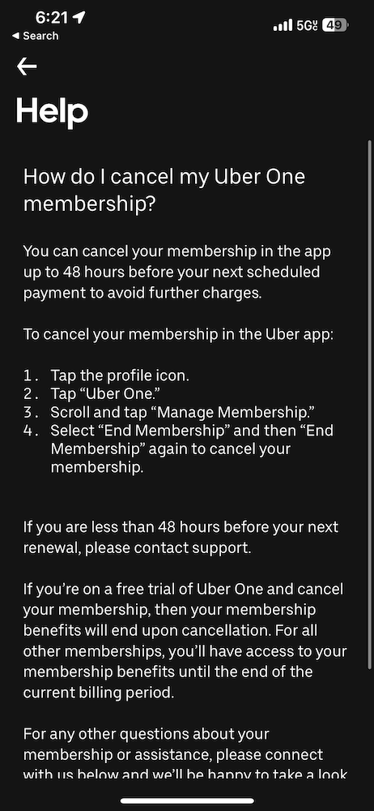

3 months ago I signed up for a trial of Uber One so I could bypass the delivery fee on my food delivery. That was my first mistake. Should’ve just gone and got some food for myself. But here we are today, 3 months later. I get charged $9.99 for Uber One. Damn, that sucks, but really it’s my fault for not cancelling it before it renewed. But I should definitely go ahead and cancel it so it doesn’t charge me again next month, right?

  
The image above shows an Uber help page that states you must cancel your membership within 48 hours of it renewing. Not sooner. There’s no cancel button if you’re not within that window.  I probably don’t need to point out the obvious here, but Uber is absolutely hoping you’ll be uninterested in talking to their outsourced support and instead forget about it until they make another $10 from you. Come on, Uber. That’s so incredibly shady. 

Now, to the support agent’s credit, he cancelled my membership and only had to be asked a total of three times. Not too terrible! But what the fuck, Uber?

